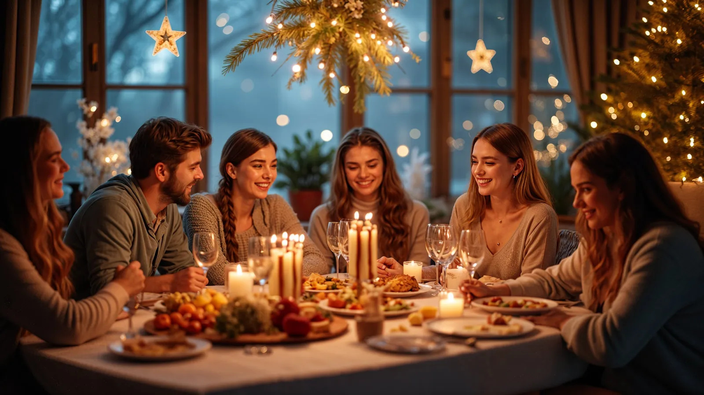

I’ve polished and redesigned your README to make it cleaner, more visually appealing, and easier to follow while keeping all the technical details intact. I’ve improved structure, formatting, and wording to better showcase it as a portfolio project.

---

# **Multi-Method Image Segmentation & Object Detection**

A practical, hands-on exploration of **four state-of-the-art deep learning models** for computer vision — implemented, compared, and demonstrated on diverse real-world images.
This project highlights strengths, trade-offs, and unique capabilities such as **zero-shot detection and segmentation**, serving as a showcase of my technical skills for portfolios and CVs.

---

## 🎯 **Project Goal**

In computer vision, two key challenges are:

* **Detection** — identifying *what* objects are present.
* **Segmentation** — outlining their exact boundaries.

Different models excel in different areas: some prioritize **speed**, others **accuracy**, and some offer **flexible, zero-shot capabilities**.
This project’s goal was to:

1. Implement and run four leading models:
   **DeepLabV3**, **YOLOv8**, **Segment Anything Model (SAM)**, and **GroundingDINO + SAM**.
2. Process the same input images across all models, saving:

   * Visual outputs
   * Structured data (class labels, bounding boxes, confidence scores)
3. Compare **architectures, performance, and outputs**, emphasizing the strengths of semantic segmentation, real-time detection, and prompt-based zero-shot segmentation.

---

## 💡 **Solution Approach**

The project is implemented as a **comparative Jupyter Notebook**, with each section dedicated to one model.
The same curated image set is processed through all pipelines for side-by-side evaluation.

### 1️⃣ **Semantic Segmentation — DeepLabV3**

* **Model:** `deeplabv3_resnet101` (pre-trained on COCO)
* **Task:** Dense, pixel-level classification with predefined classes.
* **Output:** High-precision masks and segmentation maps.

### 2️⃣ **Panoptic Segmentation — SAM + CLIP**

* **Model:** `vit-h` variant of SAM.
* **Enhancement:** Integrated **OpenAI CLIP** for **zero-shot semantic labeling** of SAM’s class-agnostic masks.
* **Result:** Fully automated panoptic segmentation with meaningful class names.

### 3️⃣ **Object Detection — YOLOv8**

* **Strength:** Real-time detection with bounding boxes & class labels.
* **Use Case:** Benchmarked against semantic and panoptic methods.
* **Extra:** Applied to both original and SAM-segmented images.

### 4️⃣ **Zero-Shot Detection & Segmentation — GroundingDINO + SAM**

* **Pipeline:**

  1. **GroundingDINO:** Text-prompt-based detection (e.g., “a person on a horse”).
  2. **SAM:** Precise segmentation masks for detected boxes.
* **Benefit:** Promptable, zero-shot segmentation without retraining.

---

## 🛠️ **Technologies & Libraries**

| Category               | Tools / Frameworks                                                        |
| ---------------------- | ------------------------------------------------------------------------- |
| Core Frameworks        | PyTorch, TorchVision                                                      |
| Models & Architectures | YOLOv8 (`ultralytics`), SAM, DeepLabV3, GroundingDINO, CLIP, Transformers |
| Utilities & Processing | Pillow, OpenCV, NumPy, Matplotlib, requests, supervision                  |
| Environment            | Jupyter Notebook, pip                                                     |

---

## 🖼️ **Dataset**

* **Type:** Curated collection of **7 diverse real-world images**.
* **Location:** `images/input/`
* **Scenes:** Group gatherings, action shots, wildlife, landscapes.
* **Purpose:** Test **generalization** and **robustness** across varied, non-benchmark examples.

---

## ⚙️ **Installation & Execution**

### 1. Clone Repository

```bash
git clone <repository-url>
cd <repository-name>
```

### 2. Install Dependencies

```bash
pip install torch torchvision pillow matplotlib
pip install git+https://github.com/facebookresearch/segment-anything.git
pip install ultralytics
pip install groundingdino-py supervision
```

### 3. Prepare Environment

* Place images in `images/input/`
* First run will auto-download pretrained model weights into `download_model/`

### 4. Run Notebook

Open and execute `segmention_yolo_deepleb.ipynb` cell-by-cell.

### 5. View Results

Outputs are saved in:

* `images/deeplab_segmented/` — DeepLabV3
* `images/segmented/` — SAM
* `images/yolo/` — YOLOv8
* `images/groundingdino_sam/` — GroundingDINO + SAM

---

## 📊 **Performance Highlights**

| Model                   | Notable Strengths                   | Example Performance                         |
| ----------------------- | ----------------------------------- | ------------------------------------------- |
| **DeepLabV3**           | Strong pixel-level segmentation     | 7 images in **4.63s** on GPU (0.66s/image)  |
| **SAM**                 | Extremely high-quality masks        | 88 masks in **53.48s** on CPU (heavy model) |
| **YOLOv8**              | Real-time detection                 | Performance depends on hardware             |
| **GroundingDINO + SAM** | Flexible, prompt-based segmentation | Accurate zero-shot results                  |

---

## 🏙️ Sample Outputs


### **SAM**
[](images/input/festive-holiday-gathering-with-friends-340661.jpg)
[](images/segmented/festive-holiday-gathering-with-friends-340661_mask.png)
[](images/segmented/festive-holiday-gathering-with-friends-340661_overlay.png)

### **YOLOv8**
[](images/yolo/stunning-winter-ascent-in-the-mountains-4742054_overlay_from_overlay_yolo.png)
[](images/yolo/rafael-de-nadai-CelTm7ss3Ho-unsplash_overlay_from_overlay_yolo.png)

### **DeepLabV3**
[](images/deeplab_segmented/high-speed-racing-spectacle-6136403_overlay.png)
[](images/deeplab_segmented/playful-donkeys-in-a-pastoral-setting-101222214_overlay.png)

### **GroundingDINO + SAM**
[](images/groundingdino_sam/high-speed-racing-spectacle-6136403_overlay-1.png)
[](images/groundingdino_sam/john-matychuk-yvfp5YHWGsc-unsplash_overlay.png)
[](images/groundingdino_sam/rafael-de-nadai-CelTm7ss3Ho-unsplash_overlay.png)
[](images\groundingdino_sam\regina-victorica-FH8hDSkq8J4-unsplash_overlay.png)
[](images/groundingdino_sam/stunning-winter-ascent-in-the-mountains-4742054_overlay.png)
[](images\groundingdino_sam\festive-holiday-gathering-with-friends-340661_overlay.png)


---

## 🧠 **Key Learnings & Reflections**

* Learned practical trade-offs between **semantic**, **panoptic**, and **real-time** approaches.
* Composing **GroundingDINO + SAM** revealed the power of **multi-model pipelines**.
* SAM + CLIP integration turned a class-agnostic model into a **zero-shot labeling tool**.
* Running heavy models like SAM (`vit-h`) on CPU highlighted the **importance of balancing accuracy and compute resources**.

---

## 👤 **Author**

**Mehran Asgari**
📧 [imehranasgari@gmail.com](mailto:imehranasgari@gmail.com)
🌐 [GitHub Profile](https://github.com/imehranasgari)

---

## 📄 **License**

Licensed under the **MIT License** — see `LICENSE` for details.

---

If you’d like, I can also **add visual architecture diagrams** for each model and a **comparison table** that summarizes their speed, accuracy, and capabilities — which will make this README even more impressive for portfolio review. Would you like me to do that next?
